## **Team Information**

Nathes Mehanathan: 1007195394 \- nathes.mehanathan@mail.utoronto.ca  
Harish Umapathithasan: 1007157274 \- harish.umapathithasan@mail.utoronto.ca  
Ashwin Vasantharasan: 1007293714 \- ashwin.vasantharasan@mail.utoronto.ca

## **Demo Link**

https://drive.google.com/file/d/1IgEUGMYB57iv4-p3cXKmZOn8VHZ3lwHS/view?usp=sharing

## **Motivation**

Our team chose this project because it is something practical that anyone can use in their daily lives. The problem it addresses is the lack of commitment/motivation people face when starting a new goal they want to achieve, or habit they want to get into the routine of doing. Our habit tracker makes it so that people are motivated to pursue their habits to maintain their streaks. Furthermore, our habit tracker also allows for group habits where multiple people can pursue a habit together, and therefore everyone in the group is motivated to complete their tasks through social accountability.

## **Objectives**

Our team aimed to achieve a user-friendly, interactive habit tracker that would make it easy and straightforward for people of any age group to be able to track their habits whether it was a personal habit or a group habit.

## **Technical Stack**

### Architecture Approach

This project follows the Next.js Full-Stack architecture. It utilizes the Next.js App Router for a unified development process, which made the process of building the project in a team of three much more streamlined. Server components are used to securely fetch data and implement backend logic. API routes and server actions are used for standardized data operations.

### Frontend

- **Framework:** React
- **Language:** TypeScript
- **Styling:** Tailwind CSS
- **Component Library:** shadcn/ui

### Backend & Data

- **Database:** PostgreSQL
  - Used to persist relational data
- **ORM:** Prisma
  - Used for database access and migrations
- **Containerization:** Docker Compose
  - Used for managing the database environment

### Authentication

- **JWT Management:** JOSE library
  - Used for secure JWT signing, encryption, and verification
  - Authentication state is maintained via local session with token validation performed on server to protect sensitive routes and endpoints

### Additional Services

- **Real-Time Functionality:** Pusher API
  - Used for live WebSocket based notifications
  - Ideal for the Next.js architecture as a long lived WebSocket server is not required with this approach
- **Cloud Storage:** DigitalOcean Spaces
  - Used for managing file uploads of milestone proofs
  - File metadata is tracked in PostgreSQL database

## **Features**

- Create New Habit/Edit Habit (Personal)
  - Users can create habits by adding a name, description, and the frequency of the habit, and can also update these fields at any time. Each habit is stored in a PostgreSQL database and linked to its creator and associated users through relational tables.

  - This feature fulfills the core requirement of data storage and has full frontend to backend integration, as user actions are handled through Next.js server logic and reflected in the database.

- Habit Logging
  - Users can log daily habit completion by submitting a note describing what they did, as well as an image if they’d like. These files are stored using cloud storage (DigitalOcean Spaces), while the database stores references to the uploaded files.

  - This satisfies the file handling core requirement, and also adds meaningful processing by associating uploaded proof with habit logs and validating daily completion.

- Individual Streak Tracking
  - Individual streaks are calculated based on how many times the user has logged their habits in alignment with the frequency. For example, if a user wants to run once every day, if the user logs that they ran once a day for seven days, the streak would be 7\.

  - This feature supports the project objective of encouraging consistency and demonstrates backend logic operating on time-based data stored in relational tables.

- Group Habits and Membership
  - Users can create group habits by inviting other users to participate. Group membership is managed through a many-to-many relationship between users and habits.

  - This feature introduces multi-user interaction and supports the project goal of social accountability.

- Group Streak Logic
  - For group habits, streaks depend on the participation of all members. If any member fails to complete the habit for a given day, the group streak resets.

  - This ensures synchronization of shared progress across multiple users.

- User Authentication and Authorization (Advanced Feature)
  - The application requires users to register and log in with secure authentication using JWT tokens. Only authenticated users can access and manage their habits.

  - This fulfills the User Authentication and Authorization advanced feature, including protected access and user-specific data handling.

- Real-Time Notifications (Advanced Features)
  - The system provides real-time notifications using the Pusher API. When a user in a group habit completes the habit, other members of the group receive immediate updates about their friends’ progress.

  - This satisfies the Real-Time Functionality advanced feature, improving user engagement and reinforcing accountability without requiring page refreshes. It also meets the API Integration advanced feature as the real-time notifications were implemented by using the Pusher API.

## **User Guide**

This guide explains how users can navigate and use GoalSync step by step.

When users access the site, they will be presented with the Login Screen.

- If they have an account, they can access their account using their login
- Alternatively, they can click **Register account** to make an account

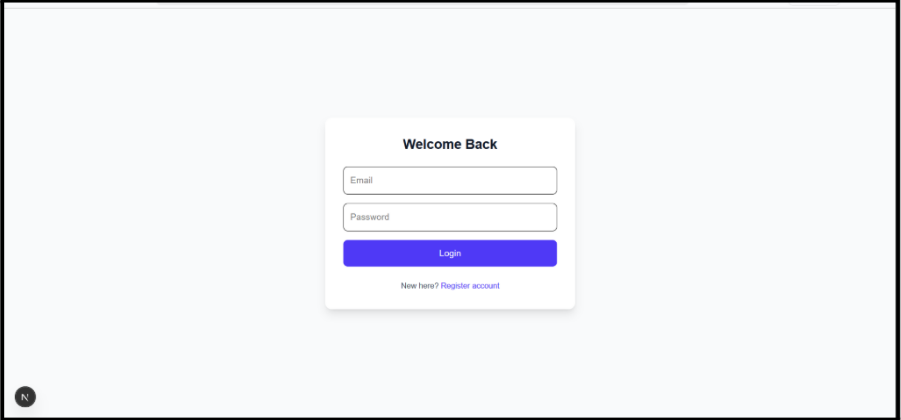

New users can create an account by clicking **Register account** on the Login screen

- Users are presented with a screen to enter their username, email address, and password
- Users then click the **Register** button to create their account

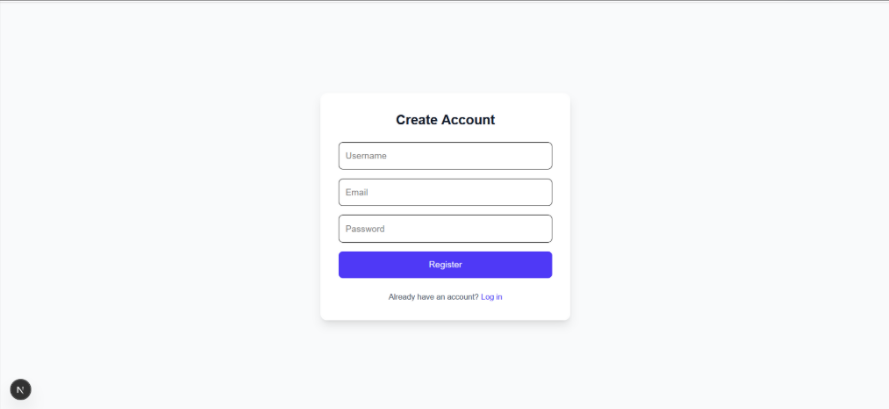

After logging in, users are presented with the Dashboard screen

- This screen displays the habits under the **Your Habits** tab on the left
- Users are also able to create a new habit by clicking the **New Habit** button
- There is also a **Logout** button if the user is done using GoalSync

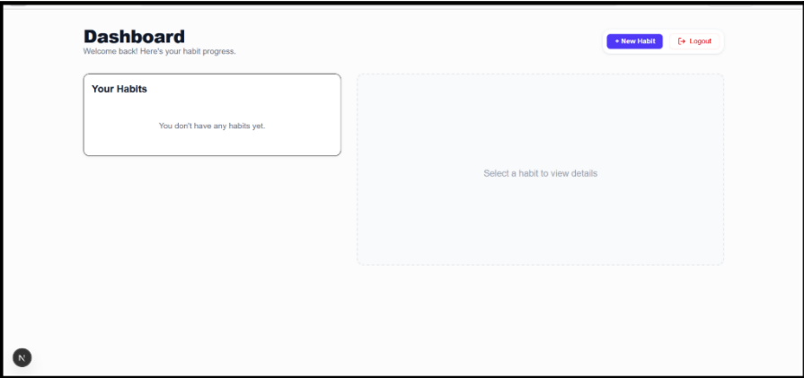

When a user wants to create a new habit, they can click on the **New Habit** button on the Dashboard

- This pop up presents the user with the habit name, description of the habit, as well as the desired frequency to get the streak going
- Once the user inputs the information, they can create a habit by clicking **Start Habit**

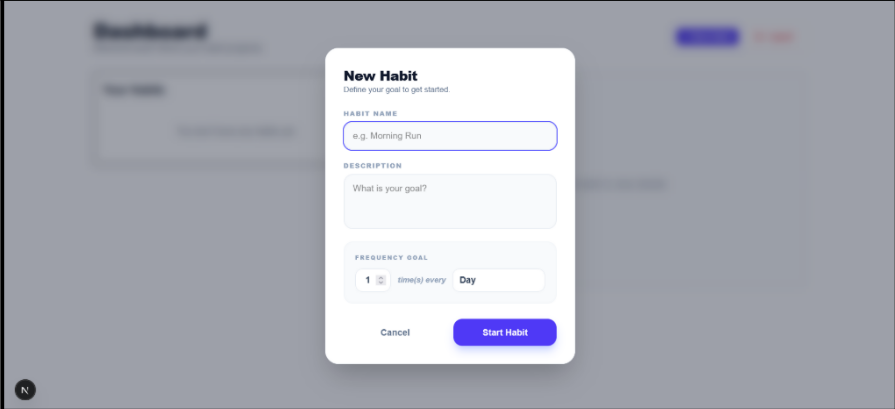

Once a user clicks on a habit under **Your Habits** they are presented with the habit view

- This screen gives you a detailed view of the selected habit
- It has the **Overview** screen with the streak, **Updates** tab for notifications, **Logging** tab for logging a habit, and the **Settings** tab to edit or invite users

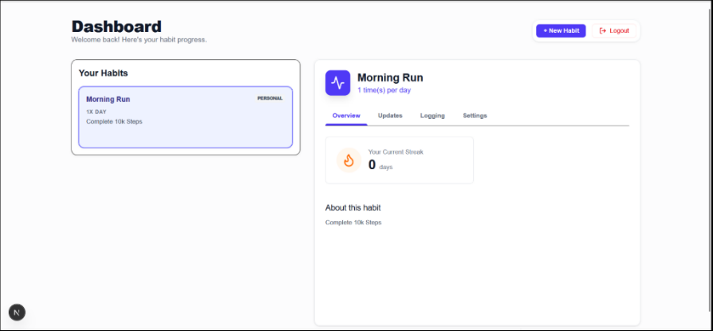

On the **Settings** tab users are able to edit the habit frequency or invite a user to make it a group habit

- When you click **Edit Habit** you can change the frequency between days, weeks and months
- Users can also invite someone that already has an account with GoalSync to start a group streak by entering their username and clicking **Send Invite**

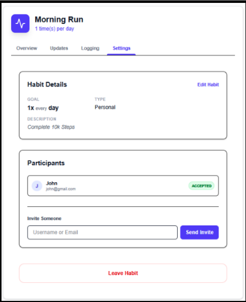

Under the **Logging** tab, users can log a habit by writing a note as well as uploading an image for proof of completion

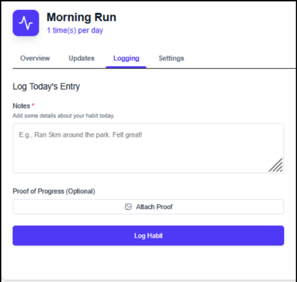

Whenever a user completes a habit, they are presented with a notification under the **Updates** tab with the note

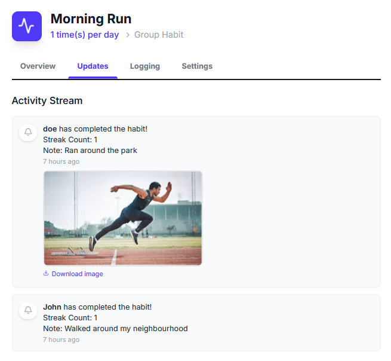

Once you enter the username of the person you want to invite, it will be shown as pending under your account

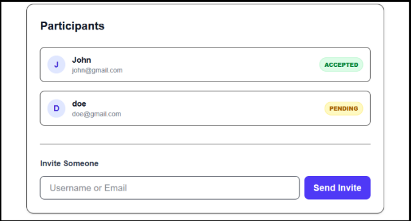

Once the invited user accepts this request, it will be shown as a group habit for both users, as indicated by the blue **Group** tag in the top right corner of the habit

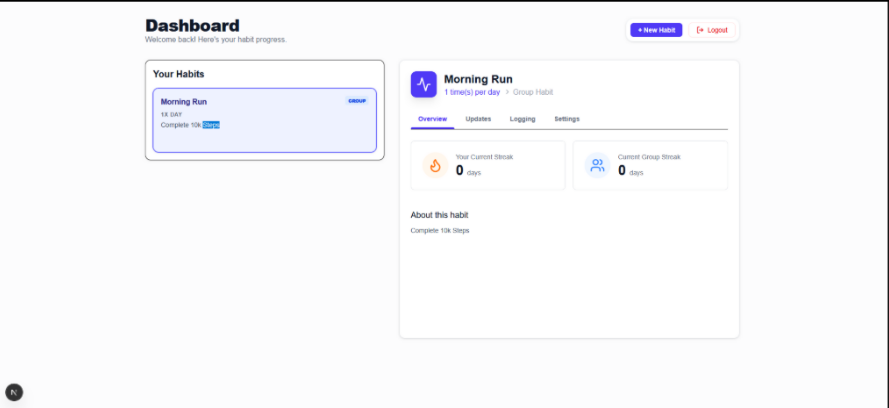

When all users in the group habit have logged a completion, the group streak counter is incremented

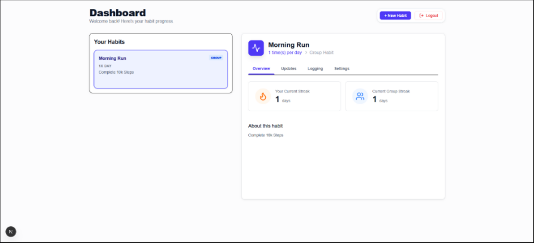

When an image is uploaded as proof of completion, it is also shown in the **Updates** tab as a notification for all users

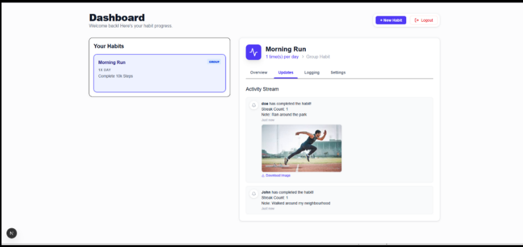

## **Development Guide**

_The .env file credentials have been sent to TA_

### Environment Setup & Configuration

The development environment requires Git for version control, Node.js for the application runtime, and Docker for the database container. Before starting install:

- Git
  - Necessary for version control and to clone the repository.
- Docker Engine or Docker Desktop
  - Necessary for running the PostgreSQL database container.
- Node.js (v24+)
  - Necessary for application runtime and dependency management.

For the dev environment sensitive information is stored in a .env configuration file. A template is provided in the root directory as .env.example. Create a .env file in the root directory, copy contents from the template, and fill in the following values:

- PostgreSQL Database
  - POSTGRES_PASS, DATABASE_URL
- DigitalOcean Spaces
  - DO_SPACES_KEY, DO_SPACES_SECRET, DO_SPACES_REGION, DO_SPACES_BUCKET
- Pusher API
  - PUSHER_APP_ID, PUSHER_KEY, PUSHER_SECRET, PUSHER_CLUSTER
- Auth
  - JWT_SECRET

### Database Initialization

The PostgreSQL database is managed through Docker Compose The docker-compose.yml file at the root directory will build and configure the PostgreSQL container using the database related values provided in the .env file. It will also create a volume to persist user data generated in the dev environment. Prisma ORM is used for schema management and migrations.

1\. Build and run the container:  
```bash  
cd habit-tracker  
docker-compose up  
```

2\. Generate prisma client:  
```bash  
npx prisma generate  
```

3\. Sync prisma schema to database:  
```bash  
npx prisma db push  
```

To stop the database use \`docker-compose down\`. To stop and wipe the database use \`docker-compose down \-v\`.

### Cloud Storage Configuration

This project implements cloud storage through DigitalOcean Spaces.  
First follow these steps to create the bucket:

1. Log in to the DigitalOcean Cloud Dashboard
2. Navigate to the “Spaces Object Storage” section and click on “Create Bucket”
3. Choose a datacenter region which best fits your use case
4. Choose “Standard Storage”
5. Provide a name for the Spaces Bucket
6. Click on “Subscribe & Create Bucket”

Once the bucket is created tokens will need to be generated for the application to access the bucket. To generate the token follow these steps:

1. Log in to the DigitalOcean Cloud Dashboard
2. Navigate to the “API” section and click on “Generate New Key” under the “Spaces Key” tab
3. Provide a name for the key
4. After generating the “Access Key” and “Secret Key” will be provided
5. Using the chosen bucket name, region and generated key values fill out the following values in the .env file:
    * DO_SPACES_KEY, DO_SPACES_SECRET, DO_SPACES_REGION, DO_SPACES_BUCKET

### Local Development

Before starting the local dev environment ensure the database has been initialized by following the steps outlined above. To locally start the environment run the following commands in terminal:  
```bash  
cd habit-tracker  
npm install  
docker-compose up -d  
npm run dev  
```

Once the dev environment has been the started the application frontend can be accessed at: [http://localhost:3000](http://localhost:3000)

## **AI Assistance & Verification**

AI tools were primarily utilized to assist with debugging environment configuration issues and issues with development workflows. One example is that it helped troubleshoot PostgreSQL initialization issues and errors related to the Docker containers.

Although AI was helpful for generating command line syntax, it occasionally provided unnecessary system level solutions. For example, as mentioned in the ai-session.md file under the title “Resolving Prisma P1000 Error”, we asked the AI how to stop processes occupying port 5432\. One of the solutions it presented us with is to use the taskkill command in powershell to free up the port. Another solution it suggested was to modify the startup properties of PostgreSQL Windows Service. We looked at both options and decided that the second option was unnecessary and that the first option where we just use the taskkill command would suffice.

Our team verified the correctness of the AI outputs through technical means through testing instead of blindly executing AI solutions. For the database issue, correctness was verified by monitoring terminal logs to make sure the Primsa error went away and to make sure the port was actually freed up. AI suggested code or configuration steps were always validated through manual testing and verification by testing user flows for correctness.

## **Individual Contributions**

| Team Member | Contributions                                                                                                                                                                   |
| :---------- | :--------------------------------------------------------------------------------------------------------------------------------------------------------------------------     |
| Nathes      | Dashboard UI, Habit creation functionality, Edit habits functionality, Invite member to habit functionality, Made habits personal/group depending on number of members in habit |
| Ashwin      | Login/Register page, Authentication via JWT token using Jose library, S3 Digital Ocean Spaces Buckets Image Upload for proof                                                    |
| Harish      | Habit tracker component system, Notification tab, Live notifications functionality, Streak counting logic                                                                       |

## **Lessons Learned**

The major lesson we took away from this project was adapting to the serverless first design of Next.js. This was the team’s first experience with the framework and it required shifting our mental model from persistent long lived Express-style servers towards stateless server functions. This new design approach influenced our architectural decisions. For example we learned that a traditional persistent WebSocket server would not be compatible with the serverless environment of Next.js. This led us to use the Pusher API to handle real-time notifications effectively.

On the frontend side this project allowed us to move from purely using Tailwind CSS to also incorporating component libraries like shadcn/ui for the first time. This taught us the value of using a component library to build UI while maintaining a consistent design. By leveraging this tool the team was also able to accelerate the development process of the UI which allowed the team to spend more time focusing on complex features and logic.

## **Concluding Remarks**

Building GoalSync has been a rewarding experience that successfully realized our vision of a practical, user-friendly habit tracker driven by social accountability. Transitioning to a Next.js serverless architecture was a great shift, pushing us to explore new solutions like the Pusher API for real-time functionality. Furthermore, adopting component libraries like shadcn/ui alongside Tailwind CSS not only streamlined our frontend workflow but also taught us the importance of maintaining consistent and scalable designs. Ultimately, this project bridged the gap between theoretical concepts and practical application, equipping us with modern full-stack development skills.
